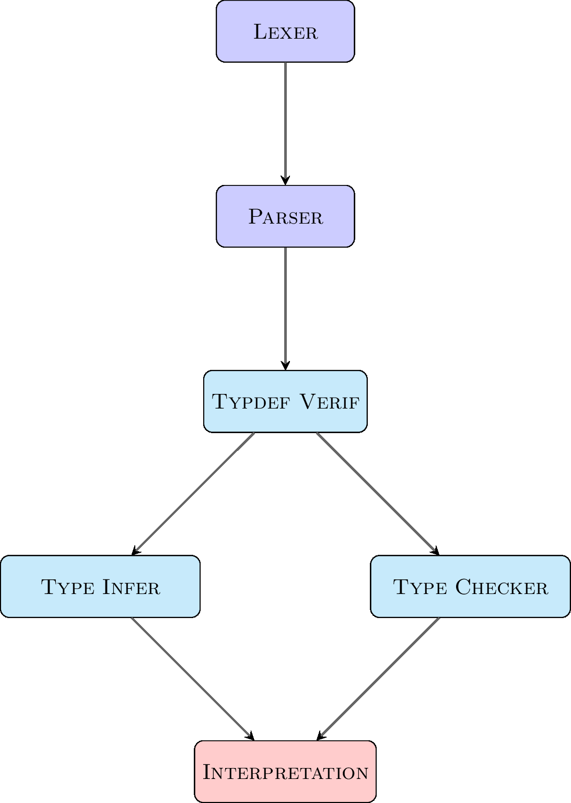

# Mini Ml

Le Mini-Ml est un sous ensemble de ML, il est composé de 2 parties :
1. Les types
2. Les expressions

## Fonctionnement 

### Lexer:
  
  Utilise Ocamllex et génère des Token définis dans le parser

### Parser:
  
  Utilise Menhir prend les token générer pas le lexer 
  et créer des expressions qui respectent la grammaire

### Typdef Verif:

  Parcours les définitions de types pour voir s'il 
  n'y a pas de type inconnue dans les définitions

### Type Checker:

  Vérifie le bon typage du programme sans polymorphisme et sans contrainte.

  Ne fonctionne plus

### Type Infer:
  
  Donne les types aux expressions et vérifie les contraintes 
  si jamais elles ne sont pas respectées il produit une erreur. 
  (Utilisation de l'algo W [^1])

## Les types

les types sont les suivants :

### Bases:

- `int` : les entiers
- `bool` : les booléens
- `unit` : l'unité

### Utilisateur 
- `type s = {id1 = e1; ...; idn = en;}` : Structures
- `type s = | Enum1 |Enum2 ...` : Types énumérés
- `type s = | Cons1 of t1 * ... * tn | ... | Const n` : Types algébriques
- `type 'a s = | Some of 'a` : Types algébriques paramétré

## Les expressions

Les expressions sont les suivantes :
- `n` : un entier
- `true` : un booléen vrai
- `false` : un booléen faux
- `()` : l'unité
- `e1 ~ e2` : Les expression binaires
    - ~ est un opérateur binaire parmis `+`, `-`, `*`, `/`, `mod`, `==`, `!=`, `<`, `<=`, `&&`, `||`
    - l'égalité structurelle et la négation `=`, `<>`
- `~ e` : Les expression unaires
    - ~ est un opérateur unaire parmis `-`, `not`
- `if e1 then e2 else e3` : l'expression conditionnelle
- `let x = e1 in e2` : l'expression de déclaration de variable
- `let rec x = e1 in e2` : l'expression de déclaration de fonction récursive
- `fun x -> e` : l'expression de déclaration de fonction anonyme
- `e1 e2` : l'expression d'appel de fonction
- `{a1 = e1; ...; an = en;}` : l'expression de création de structure
- `e.a` : l'expression d'accès à un champ de structure
- `e1.a <- e2` : l'expression d'écriture à un champ de structure
- `Enum` : Construction d'une varaible enum
- `Constr(e1, ...)`: Construction d'une varaible algébriques

# Avancée

|              | mmllexer | mmlparser | typechecker | interpreter |
|:------------:|:--------:|:---------:|:-----------:|:-----------:|
| Arithmétique |     X    |     X     |      X      |      X      |
|   Variables  |     X    |     X     |      X      |      X      |
|   Fonctions  |     X    |     X     |      X      |      X      |
|  Structures  |     X    |     X     |      X      |      X      |
|   Récursion  |     X    |     X     |      X      |      X      |

# References

[^1]: B. Heeren, J. Hage, and S. D. Swierstra. Generalizing Hindley-Milner type inference algorithms. Technical Report UU-CS-2002-031, Institute of Information and Computing Science, University Utrecht, Netherlands, July 2002.
